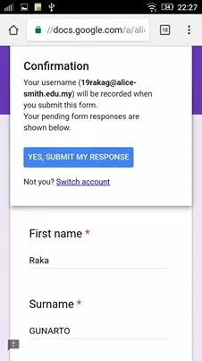
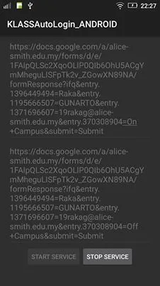
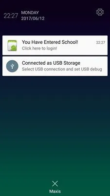

Recently, I’ve been reading and trying to implement geofencing on Android.

So far it has been quite successful, I have implemented a working project that has a geofence around my school and alerts to user to login and logout on entering or exiting the school grounds.

This app was intended as a solution to student registration during study leave in my school, as during exams students can come and go as they like. The school already had a solution of using a login page and a google form to login/logout to school, but many students forgot or were too lazy so therefore the solution wasn’t very good. This imposed a health and safety risk, because then the school wouldn’t know which students are in school during an emergency.

So using geofencing, I created an app that would send a notification to the student that links to their auto-filled google form for login when entering and for logout when exiting.

I have shown the app to the school and they liked it, so I’m continuing to improve the app and fix bugs as well as testing it with testers.

