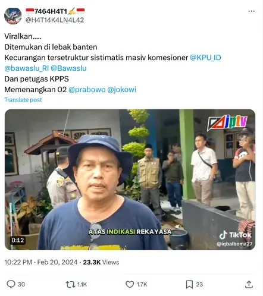
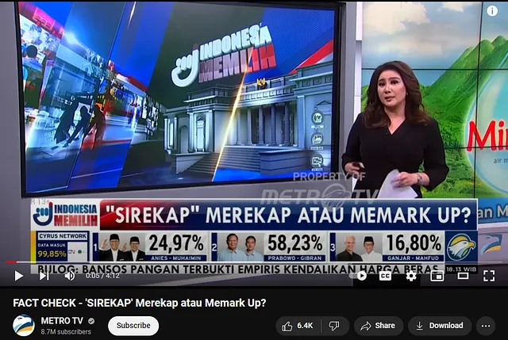
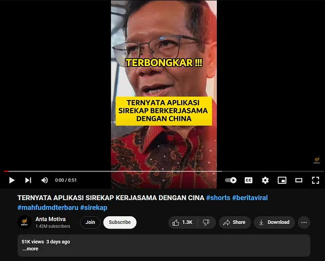
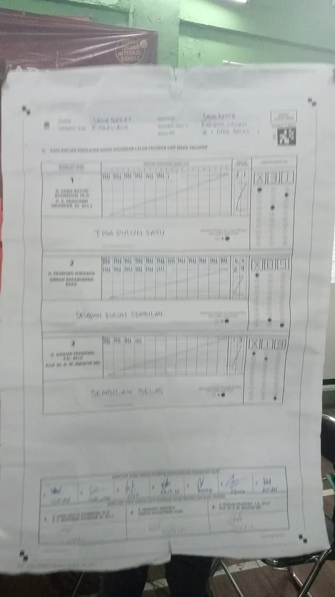
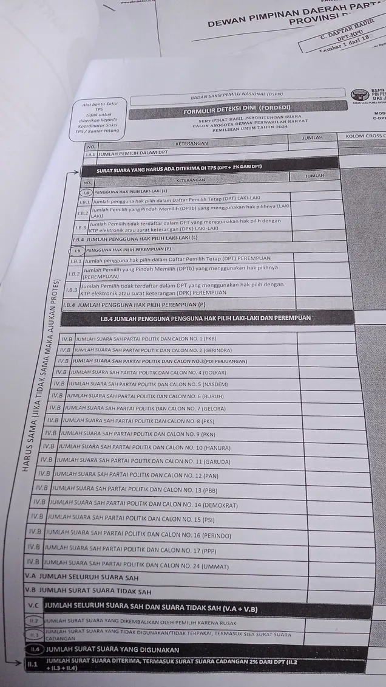
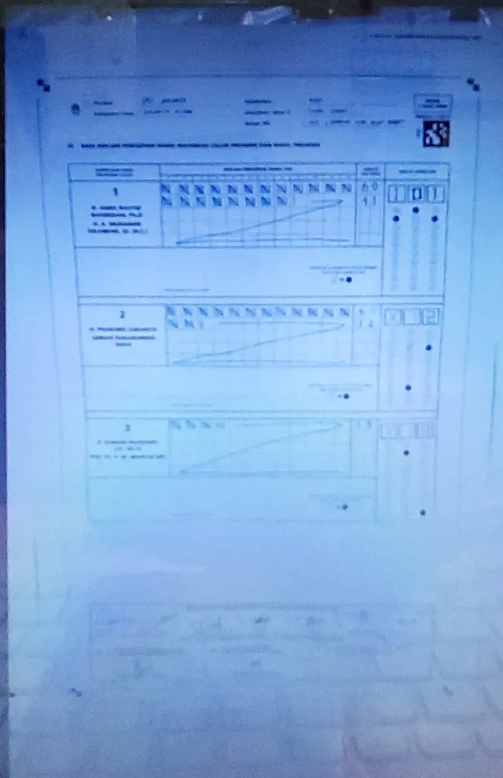
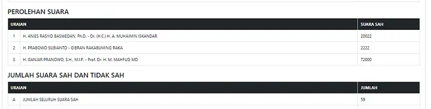
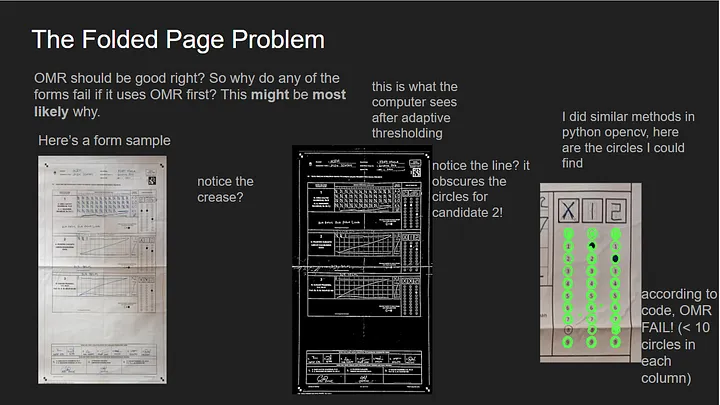

Launched with the promise of enhancing transparency and efficiency in the 2024 Presidential Elections, SIREKAP aimed to leverage Optical Character and Mark Recognition (OCR / OMR) technology to accurately and easily count ballots for a live quick count. However, its implementation has been marred by controversy, raising questions about the system’s reliability, security, and overall effectiveness.

The controversy around SIREKAP revolves around its inadequacies in handing the logistical and technical demands of Indonesia’s vast electoral landscape. Issues with the system ranges from slow processing times to more severe concerns about data security and potential data manipulation. These challenges have not only cast doubt on the system’s ability to deliver accurate quick count results but also raises questions on the readiness of deploying such technologies in the critical democratic process, from a trusted government entity no less.

The system’s rollout, criticized for its high cost and the myriad of issues encountered, serves as a cautionary tale of the pitfalls of rushed digitalisation in highly sensitive and complex environments like national elections.

---

### Lack of Communication: A Catalyst for Confusion

One of the primary issues of SIREKAP’s rollout is the lack of communication from the government — it came out of nowhere. This led to an immediate distrust from the public when their first exposure came from a video of the system apparently inflating votes for a particular candidate. The way the data is presented can also be easily misunderstood as a new system to provide the final authoritative results of the election, when SIREKAP is only supplementary to the final manual count with the main objective of transparency. The public could have benefitted in being briefed on the rollout of the new system, including its potential limitations.

This lack of public preparation was ultimately a show in recklessness and hubris, which led to a firework display of misinformation across social media. Governmental elections fundamentally influence a nation’s social behaviour, and the government must take responsibility in ensuring clear communication. When this trust falls apart, the legions of for-profit misleading media and paid keyboard warriors “buzzers” pounce on the opportunity to fabricate any narrative they desire.

|  |  |  |
| :---: | :---: | :---: |
|  |  |  |

These basic communication failures undermine public trust in the electoral process, risking widespread unrest and eroding the foundational confidence in our democratic system.

### Design and Usability: Overlooked Real-World Complexities

In theory, using computer vision to digitise and automate vote counting was a good step in election modernisation and transparency. However, the execution lacks consideration of the variability in image quality and user behaviour. This oversight led to significant data inaccuracies, suggesting a disconnect between the system’s designers and the actual users.

The user interface (UI) did not guide or restrict user submissions to ensure adequate image quality, a must-have for reliable computer vision performance. There appears to have been an oversight in testing real-world scenarios — such as poor lighting and poor camera/image quality — that lead to the major issues encountered in the 2024 elections. In addition, there was a clear lack of user training or instructions, seen in the pictures below:

|  |  |  |
| :---: | :---: | :---: |
|  |  |  |

Moreover, the forms have clearly been designed with computer vision in mind, the presence of an AprilTag (a fiducial marker used in computer vision applications) and the checkerboard corners being prime examples. When inspecting the Android app however, these markers seem to be there for decoration, as there is no requirement of their presence. Stricter image validation and prompting for image recapture had the potential to greatly reduce the issues observed and improve the system’s robustness.

Even more puzzling, there seems to be a lack of simple data validation. Given the relationships between the data in the forms — like candidate votes and the total number of valid ballots — a logical check to confirm these figures aligns should have been in place. Inputs failing to meet the logical relationships should have triggered rejections, or at least invalidations for manual review by KPU. Instead these values were allowed, leading to inaccuracies being propagated through to the preliminary / quick count results shown to the public.



Finally, the system’s data submission flow had some questionable decisions. Staff at polling stations were barred from manually correcting data from erroneous OCR/OMR results, with the app guiding them to simply mark them as errors for review by KPU and proceed. With results having a default state of being valid, users can forego checking the results and click submit, allowing the possibility of unverified submissions due to user fatigue or frustration. Users have reported that each submission attempt can take up to 10 minutes, which makes the scenario of user fatigue very possible. Ironically, these design choices contradicted the system’s intended purpose of streamlining data entry.

```java
<TextView android:textColor="@color/colorInfo60" android:id="@+id/text_caption_ppwp_hal_2" android:tag="binding_1" android:layout_width="wrap_content" android:layout_height="wrap_content" android:layout_marginBottom="8dp" android:text="Pada halaman ini Anda hanya perlu menandai sesuai/tidak sesuai dan tidak perlu memberikan koreksi angka." android:paddingStart="24dp" android:paddingEnd="24dp" style="@style/TextAppearance.MaterialComponents.Caption"/>
```

### OCR/OMR: An overreliance on imperfect technology

OCR/OMR (Optical Character / Mark Recognition) is not novel technology. They are computer vision techniques to recognise characters and markings. OMR dates back to the mid 1900s and has since been widely used for automated scoring of multiple choice exams. It is a simple technology to recognise marks made on paper in predetermined locations. OCR however is more complex involving recognition of printed characters. This is more challenging especially when dealing with handwritten digits, which may have some variance.

The expectation that accurate OCR/OMR results could be obtained from images captured under less than ideal conditions — such as varied angles and lighting from budget cameraphones — is optimistic at best. This process is further compromised by relying on a single error check, which requires proactive user action for verification. It is made even worse that the application runs client side TensorFlow models on these budget devices for OCR, whereby many users have ignored the digit formatting guidelines on the form, rendering the model useless in some cases.

Reverse engineering reveals OMR is attempted first, falling back to the less reliable OCR if it fails. The OMR fails when not enough circles are detected on the form segment for each digit column. Many forms however appear creased, likely from folding, with creases intersecting crucial areas, like the ‘8’ bubble in the second candidate’s section, risking misinterpretation or missed detections.

[OCR/OMR Analysis](https://docs.google.com/presentation/d/1YEWkZf19f8jlqR-fczvUK9STbG8fHJQNDzvwcDi4VAA/edit?usp=sharing)



Simply allowing users to modify erroneous results directly or stricter image validation using the previously mentioned computer vision markers would have greatly improved the accuracy of the system’s results.

### Infrastructure: Unprepared for the Demands of Reality

Numerous users have reported a decline of the system’s responsiveness in peak times. There are reports of image uploads taking longer than 5 minutes. Considering their choice of deploying on public cloud infrastructure, scaling should not have been an issue with the many methods available for cloud solutions.

This brings us to the next problem, the use of public cloud for a system in a sensitive context such as presidential elections. Although not inherently an issue, the use of public cloud raises additional concerns regarding data sovereignty and security. While cloud services offer scalability (seemingly unused) and flexibility, the sensitivity of election data — even supplemental — requires extra care and protection that was not adequately considered in the SIREKAP system.

A hybrid cloud approach could have been better suited as sensitive operations and data can be kept on-premises and within borders, with other functions such as public data replication and access being offloaded to the public cloud. Stress testing infrastructure under simulated peak load is also essential to ensure quality of service during live traffic.

### Security: A Critical Oversight

The security strategy (or lack thereof) for SIREKAP is maybe the second-most alarming aspect of the system, next to the overreliance of OCR/OMR. In today’s era of cyber threats, the system had an attack surface that was too exposed for comfort.

There is simply no reason for the authentication and data submission APIs for the system to be public facing. These should have been gated behind a proxy, with an added layer of protection through secure cryptographic means such as client certificates. App inspections and user reports also indicate a lack of two-factor authentication. While the system uses a known good implementation of OAuth (Keycloak), the lack of two-factor authentication makes credential theft trivial.

The security measures to prevent unauthorised access and data integrity, given the stakes in this context, is insufficient. The author calls for a full security audit by an independent third party to be made against the SIREKAP system with the results published to the public domain.

### Conclusion

SIREKAP’s deployment highlights the necessity of real-world considerations during system design, robust infrastructure, and security for systems in sensitive contexts such as elections. The lessons from this experience shows how important it is to have a solid testing strategy and a user-centric design. As we reflect on these lessons, the path forward must involve a commitment to ensure technological innovations are implemented with the utmost care of integrity and reliability, especially when it is concerned with the democratic process.